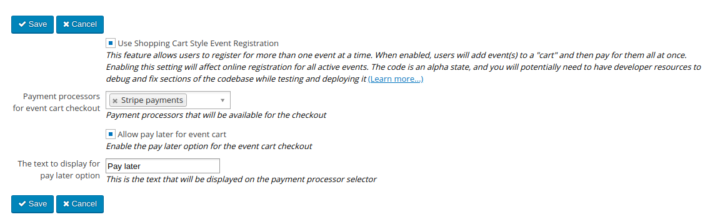

# eventcart

## MJW Version

This extension implements https://github.com/civicrm/civicrm-core/pull/17886 on CiviCRM 5.28 to enable payments and multiple payment processors.

## Installation

* The MJW version adds a new settings page at Administer->CiviEvent->Event Cart Settings:

## Description

This extracts most of the event cart functionality into an extension.

The extension is licensed under [AGPL-3.0](LICENSE.txt).

## Remaining work

1. Move CRM_Event_Cart_DAO_Cart and CRM_Event_Cart_DAO_EventInCart from CiviCRM core (see https://github.com/civicrm/civicrm-core/pull/17339 for details).
1. There are various places in CiviCRM which still check the setting `enable_cart`. These should be moved to this extension.
1. The "Conference Slots" functionality is only enabled if Event Cart is enabled so that should be moved into this extension too.

## Support and Maintenance
This extension is supported and maintained with the help and support of the CiviCRM community by:

We offer paid [support and development](https://mjw.pt/support) as well as a [troubleshooting/investigation service](https://mjw.pt/investigation).
